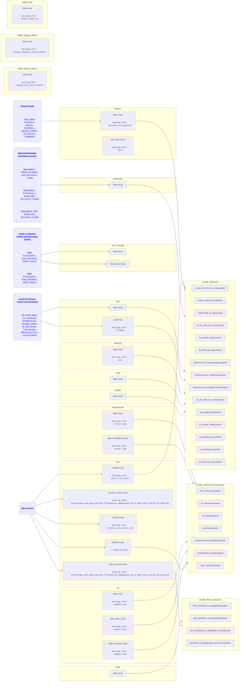

```mermaid
flowchart LR
    classDef pass stroke:#66bb6a
    classDef warn stroke:#ffa726
    classDef fail stroke:#f44336
    s0("`<h4><a href="https://data.cdc.gov" target="_blank" rel="noreferrer">Center for Disease Control and Prevention</a></h4><br/><ul><br/><li><code><a href="https://data.cdc.gov/resource/qvzb-qs6p/" target="_blank" rel="noreferrer">Serotype Data for Invasive Pneumococcal Disease Cases by Age Group from Active Bacterial Core surveillance</a></code></li></ul>`")
    s1("`<h4><a href="https://cosmos.epic.com/" target="_blank" rel="noreferrer">Epic Cosmos</a></h4>`")
    s2("`<h4><a href="https://trends.google.com" target="_blank" rel="noreferrer">Google Trends</a></h4><br/><ul><br/><li><code><a href="https://github.com/DISSC-yale/gtrends_collection" target="_blank" rel="noreferrer">Yale Data-Intensive Social Sciences, Google Trends Collection Framework</a></code></li></ul>`")
    s3("`<h4><a href="https://www.cdc.gov/nchs/nvss/vsrr/drug-overdose-data.htm" target="_blank" rel="noreferrer">Center for Disease Control and Prevention (NCHS)</a></h4><br/><ul><br/><li><code><a href="https://data.cdc.gov/National-Center-for-Health-Statistics/VSRR-Provisional-Drug-Overdose-Death-Counts/xkb8-kh2a/about_data" target="_blank" rel="noreferrer">VSRR Provisional Drug Overdose Death counts</a></code></li></ul><br/><ul><br/><li><code><a href="https://data.cdc.gov/National-Center-for-Health-Statistics/VSRR-Provisional-Drug-Overdose-Death-Counts/xkb8-kh2a/about_data" target="_blank" rel="noreferrer">VSRR Provisional Drug Overdose Death Counts</a></code></li></ul>`")
    s4("`<h4><a href="https://www.cdc.gov/nwss" target="_blank" rel="noreferrer">National Wastewater Surveillance System</a></h4><br/><ul><br/><li><code><a href="https://www.cdc.gov/nwss/rv/COVID19-statetrend.html" target="_blank" rel="noreferrer">Wastewater COVID-19 State and Territory Trends</a></code></li></ul><br/><ul><br/><li><code><a href="https://www.cdc.gov/nwss/rv/InfluenzaA-statetrend.html" target="_blank" rel="noreferrer">Wastewater Influenza A State and Territory Trends</a></code></li></ul><br/><ul><br/><li><code><a href="https://www.cdc.gov/nwss/rv/RSV-statetrend.html" target="_blank" rel="noreferrer">Wastewater RSV State and Territory Trends</a></code></li></ul>`")
    subgraph abcs["`abcs`"]
        direction LR
        n1["`data.csv.gz`"]:::pass
        n2["`uad.csv.gz<ul><br/><li><code>missing_info: N_SSUAD</code></li></ul>`"]:::warn
    end
    subgraph brfss["`brfss`"]
        direction LR
        n3["`data.csv.gz`"]:::pass
    end
    subgraph delphi_doctors_claims["`delphi_doctors_claims`"]
        direction LR
        n4["`data.csv.gz<ul><br/><li><code>missing_info: delphi_doc_covid_smooth</code></li></ul>`"]:::warn
    end
    subgraph delphi_hospital_claims["`delphi_hospital_claims`"]
        direction LR
        n5["`data.csv.gz<ul><br/><li><code>missing_info: delphi_hospital_covid_smooth</code></li></ul>`"]:::warn
    end
    subgraph delphi_nhsn["`delphi_nhsn`"]
        direction LR
        n6["`data.csv.gz<ul><br/><li><code>missing_info: delphi_nhsn_covid</code></li></ul>`"]:::warn
        n6["`data.csv.gz<ul><br/><li><code>missing_info: delphi_nhsn_flu</code></li></ul>`"]:::warn
        n6["`data.csv.gz<ul><br/><li><code>missing_info: delphi_nhsn_rsv</code></li></ul>`"]:::warn
    end
    subgraph epic["`epic`"]
        direction LR
        n7["`children.csv.gz<ul><br/><li><code>time_missing</code></li></ul>`"]:::warn
        n8["`county_no_time.csv.gz<ul><br/><li><code>time_missing</code></li></ul>`"]:::warn
        n8["`county_no_time.csv.gz<ul><br/><li><code>missing_info: percentage_with_base_patient_followed_by_hemoglobin_a1c_6.5%_or_more_within_10_years_(%)</code></li></ul>`"]:::warn
        n9["`no_geo.csv.gz<ul><br/><li><code>missing_info: positive_rsv_tests_(%)</code></li></ul>`"]:::warn
        n10["`state_no_time.csv.gz<ul><br/><li><code>time_missing</code></li></ul>`"]:::warn
        n10["`state_no_time.csv.gz<ul><br/><li><code>missing_info: n_self_harm</code></li></ul>`"]:::warn
        n10["`state_no_time.csv.gz<ul><br/><li><code>missing_info: n_patients</code></li></ul>`"]:::warn
        n10["`state_no_time.csv.gz<ul><br/><li><code>missing_info: percentage_with_base_patient_followed_by_hemoglobin_a1c_6.5%_or_more_within_10_years_(%)</code></li></ul>`"]:::warn
        n11["`weekly.csv.gz<ul><br/><li><code>missing_info: epic_positive_rsv_tests_(%)</code></li></ul>`"]:::warn
        n11["`weekly.csv.gz<ul><br/><li><code>missing_info: epic_rsv_tests</code></li></ul>`"]:::warn
        n11["`weekly.csv.gz<ul><br/><li><code>missing_info: epic_n_rsv_tests</code></li></ul>`"]:::warn
    end
    subgraph gtrends["`gtrends`"]
        direction LR
        n12["`data.csv.gz<ul><br/><li><code>missing_info: gtrends_rsv_adjusted</code></li></ul>`"]:::warn
        n13["`data_dma.csv.gz<ul><br/><li><code>geography_missing</code></li></ul>`"]:::warn
        n13["`data_dma.csv.gz<ul><br/><li><code>missing_info: fips</code></li></ul>`"]:::warn
        n13["`data_dma.csv.gz<ul><br/><li><code>missing_info: value</code></li></ul>`"]:::warn
        n13["`data_dma.csv.gz<ul><br/><li><code>missing_info: term</code></li></ul>`"]:::warn
    end
    subgraph nchs_mortality["`nchs_mortality`"]
        direction LR
        n14["`data.csv.gz`"]:::pass
        n15["`data_county.csv.gz`"]:::pass
    end
    subgraph nis["`nis`"]
        direction LR
        n16["`data.csv.gz<ul><br/><li><code>missing_info: birth_year</code></li></ul>`"]:::warn
        n16["`data.csv.gz<ul><br/><li><code>missing_info: age</code></li></ul>`"]:::warn
        n16["`data.csv.gz<ul><br/><li><code>missing_info: vaccine</code></li></ul>`"]:::warn
        n16["`data.csv.gz<ul><br/><li><code>missing_info: pct_uptake</code></li></ul>`"]:::warn
        n16["`data.csv.gz<ul><br/><li><code>missing_info: pct_uptake_lcl</code></li></ul>`"]:::warn
        n16["`data.csv.gz<ul><br/><li><code>missing_info: pct_uptake_ucl</code></li></ul>`"]:::warn
        n16["`data.csv.gz<ul><br/><li><code>missing_info: sample_size</code></li></ul>`"]:::warn
        n17["`data_insurance.csv.gz<ul><br/><li><code>time_missing</code></li></ul>`"]:::warn
        n17["`data_insurance.csv.gz<ul><br/><li><code>missing_info: insurance</code></li></ul>`"]:::warn
        n17["`data_insurance.csv.gz<ul><br/><li><code>missing_info: birth_year</code></li></ul>`"]:::warn
        n17["`data_insurance.csv.gz<ul><br/><li><code>missing_info: vaccine</code></li></ul>`"]:::warn
        n17["`data_insurance.csv.gz<ul><br/><li><code>missing_info: value</code></li></ul>`"]:::warn
        n17["`data_insurance.csv.gz<ul><br/><li><code>missing_info: value_lcl</code></li></ul>`"]:::warn
        n17["`data_insurance.csv.gz<ul><br/><li><code>missing_info: value_ucl</code></li></ul>`"]:::warn
        n17["`data_insurance.csv.gz<ul><br/><li><code>missing_info: sample_size</code></li></ul>`"]:::warn
        n18["`data_urban.csv.gz<ul><br/><li><code>time_missing</code></li></ul>`"]:::warn
        n18["`data_urban.csv.gz<ul><br/><li><code>missing_info: urban</code></li></ul>`"]:::warn
        n18["`data_urban.csv.gz<ul><br/><li><code>missing_info: birth_year</code></li></ul>`"]:::warn
        n18["`data_urban.csv.gz<ul><br/><li><code>missing_info: vaccine</code></li></ul>`"]:::warn
        n18["`data_urban.csv.gz<ul><br/><li><code>missing_info: value</code></li></ul>`"]:::warn
        n18["`data_urban.csv.gz<ul><br/><li><code>missing_info: value_lcl</code></li></ul>`"]:::warn
        n18["`data_urban.csv.gz<ul><br/><li><code>missing_info: value_ucl</code></li></ul>`"]:::warn
        n18["`data_urban.csv.gz<ul><br/><li><code>missing_info: sample_size</code></li></ul>`"]:::warn
    end
    subgraph NREVSS["`NREVSS`"]
        direction LR
        n19["`data.csv.gz<ul><br/><li><code>missing_info: source</code></li></ul>`"]:::warn
        n19["`data.csv.gz<ul><br/><li><code>missing_info: scaled_cases</code></li></ul>`"]:::warn
        n19["`data.csv.gz<ul><br/><li><code>missing_info: pcr_detections</code></li></ul>`"]:::warn
        n19["`data.csv.gz<ul><br/><li><code>missing_info: epiyr</code></li></ul>`"]:::warn
        n19["`data.csv.gz<ul><br/><li><code>missing_info: epiwk</code></li></ul>`"]:::warn
        n19["`data.csv.gz<ul><br/><li><code>missing_info: week</code></li></ul>`"]:::warn
        n19["`data.csv.gz<ul><br/><li><code>missing_info: year</code></li></ul>`"]:::warn
    end
    subgraph nssp["`nssp`"]
        direction LR
        n20["`data.csv.gz`"]:::pass
    end
    subgraph respnet["`respnet`"]
        direction LR
        n21["`data.csv.gz`"]:::pass
    end
    subgraph schoolvaxview["`schoolvaxview`"]
        direction LR
        n22["`data.csv.gz<ul><br/><li><code>geography_nas</code></li></ul>`"]:::warn
        n22["`data.csv.gz<ul><br/><li><code>missing_info: grade</code></li></ul>`"]:::warn
        n22["`data.csv.gz<ul><br/><li><code>missing_info: N</code></li></ul>`"]:::warn
        n22["`data.csv.gz<ul><br/><li><code>missing_info: vax</code></li></ul>`"]:::warn
        n22["`data.csv.gz<ul><br/><li><code>missing_info: value</code></li></ul>`"]:::warn
        n22["`data.csv.gz<ul><br/><li><code>missing_info: percent_surveyed</code></li></ul>`"]:::warn
        n22["`data.csv.gz<ul><br/><li><code>missing_info: survey_type</code></li></ul>`"]:::warn
        n23["`data_exemptions.csv.gz<ul><br/><li><code>geography_nas</code></li></ul>`"]:::warn
        n23["`data_exemptions.csv.gz<ul><br/><li><code>missing_info: grade</code></li></ul>`"]:::warn
        n23["`data_exemptions.csv.gz<ul><br/><li><code>missing_info: N</code></li></ul>`"]:::warn
        n23["`data_exemptions.csv.gz<ul><br/><li><code>missing_info: vax</code></li></ul>`"]:::warn
        n23["`data_exemptions.csv.gz<ul><br/><li><code>missing_info: value</code></li></ul>`"]:::warn
        n23["`data_exemptions.csv.gz<ul><br/><li><code>missing_info: percent_surveyed</code></li></ul>`"]:::warn
        n23["`data_exemptions.csv.gz<ul><br/><li><code>missing_info: survey_type</code></li></ul>`"]:::warn
    end
    subgraph wastewater["`wastewater`"]
        direction LR
        n24["`data.csv.gz`"]:::pass
    end
    subgraph bundle_childhood_immunizations["`bundle_childhood_immunizations`"]
        direction LR
        n25["`mmr_rates_epic.parquet`"]
        n26["`nis_insurance.parquet`"]
        n27["`nis_overall.parquet`"]
        n28["`nis_urban.parquet`"]
        n29["`schoolvaxview_exemptions.parquet`"]
        n30["`schoolvaxview_overall.parquet`"]
        n31["`state_compare.parquet`"]
    end
    subgraph bundle_chronic_diseases["`bundle_chronic_diseases`"]
        direction LR
        n32["`brfss_prevalence_by_geography.parquet`"]
        n33["`epic_prevalence_by_geography.parquet`"]
        n34["`epic_prevalence_by_geography_county.parquet`"]
        n35["`prevalence_by_geography_and_source.parquet`"]
    end
    subgraph bundle_respiratory["`bundle_respiratory`"]
        direction LR
        n36["`covid_ed_visits_by_county.parquet`"]
        n37["`covid_overall_trends.parquet`"]
        n38["`covid_trends_by_age.parquet`"]
        n39["`flu_ed_visits_by_county.parquet`"]
        n40["`flu_overall_trends.parquet`"]
        n41["`flu_trends_by_age.parquet`"]
        n42["`pneumococcus_by_geography.parquet`"]
        n43["`pneumococcus_comparison.parquet`"]
        n44["`pneumococcus_serotype_trends.parquet`"]
        n45["`rsv_ed_visits_by_county.parquet`"]
        n46["`rsv_google_dma.parquet`"]
        n47["`rsv_overall_trends.parquet`"]
        n48["`rsv_positive_tests.parquet`"]
        n49["`rsv_testing_pct.parquet`"]
        n50["`rsv_trends_by_age.parquet`"]
    end
    s0 --> n1
    s0 --> n2
    s1 --> n7
    s1 --> n8
    s1 --> n9
    s1 --> n10
    s1 --> n11
    s2 --> n12
    s3 --> n14
    s3 --> n15
    s4 --> n24
    n22 --> bundle_childhood_immunizations
    n23 --> bundle_childhood_immunizations
    n16 --> bundle_childhood_immunizations
    n18 --> bundle_childhood_immunizations
    n17 --> bundle_childhood_immunizations
    n7 --> bundle_childhood_immunizations
    n3 --> bundle_chronic_diseases
    n10 --> bundle_chronic_diseases
    n11 --> bundle_respiratory
    n12 --> bundle_respiratory
    n24 --> bundle_respiratory
    n1 --> bundle_respiratory
    n2 --> bundle_respiratory
    n19 --> bundle_respiratory
    n20 --> bundle_respiratory
    n21 --> bundle_respiratory
```
